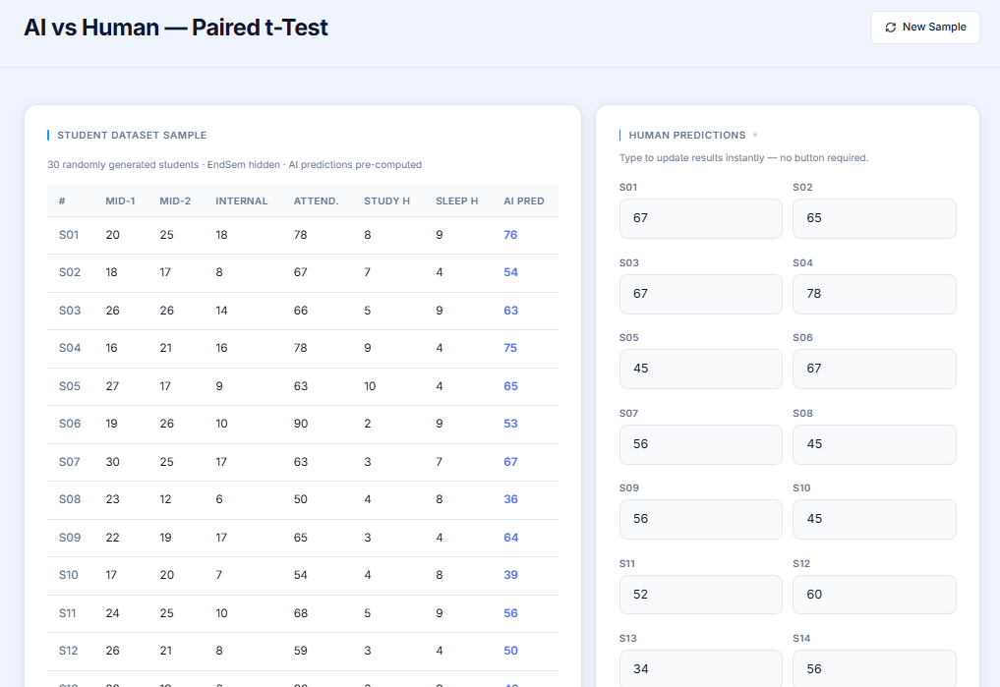
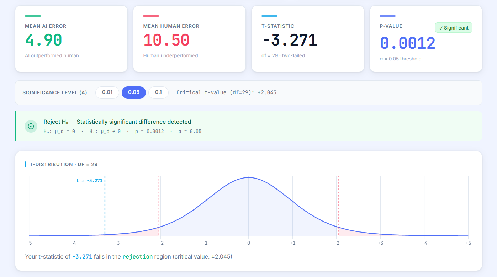
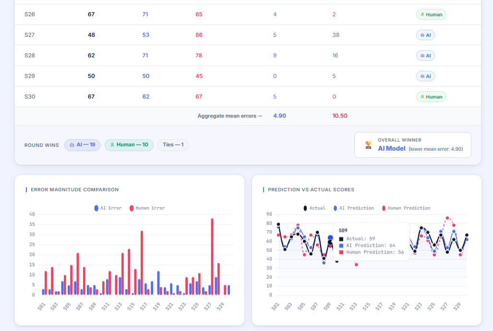
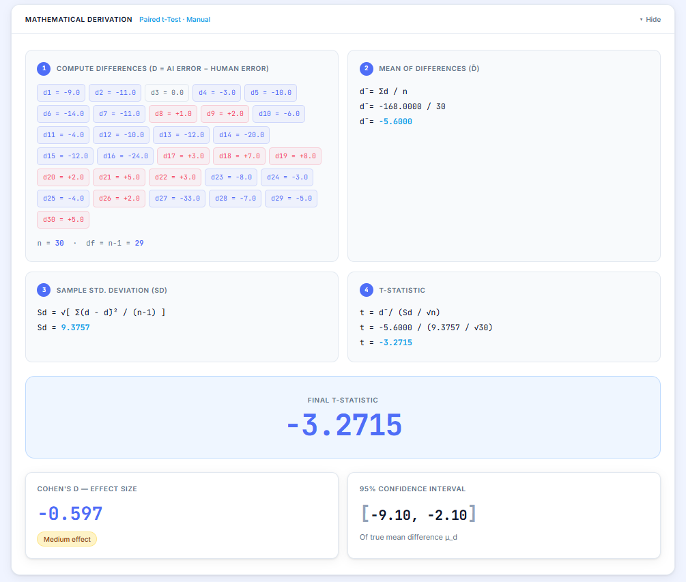

# AI vs Human Prediction — Paired t-Test

-4F6EF7?style=flat-square)


> **Course:** Engineering Mathematics 4 (EM-4 / BSC07)  
> **Topic Allocated:** Small Sampling — t-Test  
> **SE INFT C** Group 10  
>
> Sakshi Roundhal - 24101C0011  
> Shreeman Kumar - 24101C0002  
> Omkar Suryanarayan Padhi - 24101C0003  
> Shreya Murkar - 24101C0014  
> Ashwin Agrawal - 24101C0015  
> Neha Nayak - 24101C0016  

---

## Overview

This project answers a concrete statistical question: **is an AI model's prediction of student end-semester scores significantly more accurate than a human's intuitive guess?** The system relies on a custom implementation of a **paired t-test** to analyze the difference between AI prediction accuracy and Human prediction accuracy. 

**The statistical connection:** For each student, the absolute prediction error is computed for both the AI (`|Actual − AIPred|`) and the human (`|Actual − HumanPred|`). These 30 paired error values are fed into a **manually implemented paired t-test** in `math_utils.py` — written from scratch using only Python's built-in `math` module. The test determines whether the mean difference in errors is statistically significant, or merely due to chance. 

---
## UI Screenshot





## End-to-End Installation & Running Guide

This project requires **Node.js** (for the React Frontend) and **Python 3.8+** (for the FastAPI backend). 

### Prerequisites (Windows)
If Node.js is not installed, open **Command Prompt** or **PowerShell** and run:
```bash
winget install OpenJS.NodeJS.LTS
```

### 1. Backend Setup
The backend serves the AI predictions and calculates the t-test math. Open a terminal in the project root:
```bash
cd backend
pip install -r requirements.txt      # Run only the first time
uvicorn app:app --reload --port 8000 # Keep this terminal open
```
*(Backend API now runs at `http://localhost:8000`)*

### 2. Frontend Setup
The frontend is the interactive dashboard. Open a **NEW** terminal:
```bash
cd frontend
npm install              # Run only the first time
npm run sakshi           # Keep this terminal open
```
*(React app now runs at `http://localhost:5173`)*

**Access the app at:** [http://localhost:5173](http://localhost:5173)

---

## Why Paired t-Test?

The choice of paired t-test is determined directly by the structure of the code in `app.py`. The endpoint `/generate-sample` returns **the same 30 students** to both the AI (which predicts immediately) and the human (who enters predictions for those same students). This creates paired observations — for every student `i`, there is exactly one `AIError_i` and one `HumanError_i`, both anchored to the same ground-truth `Actual_i` score.

| Condition | Evidence in the code |
|-----------|----------------------|
| Same subjects evaluated by both methods | `/generate-sample` returns a single list of `n=10` students; AI predictions are pre-computed in the same loop; human enters predictions for the same IDs |
| Small sample: n < 30 | `generate_sample(n: int = 10)` — the default and only used value is 10 |
| Population standard deviation is unknown | `calculate_std_dev(differences)` in `math_utils.py` estimates σ from the sample using Bessel's correction (divides by `n-1`) |
| Errors are continuous numerical values | `ai_error = abs(actual - ai_pred)` yields a non-negative real number |
| Observations are dependent, not independent | `differences = [ai - hum for ai, hum in zip(ai_errors, human_errors)]` — each difference pairs the two errors for the same student, not separately sampled groups |

An **independent two-sample t-test** would be wrong here because AI and human errors for student S01 are both tied to S01's actual score — treating them as independent would ignore this natural correlation and reduce the test's ability to detect a real difference.

---

## Dataset & Variables

There is no static CSV file. The dataset is **generated in memory** every time the application runs. The function `train_model()` in `app.py` uses `numpy.random` to create 100 training records, and the `/generate-sample` endpoint generates 30 fresh student records.

### Feature columns (used as model inputs)

| Column | Python variable | Range (from code) | Description |
|--------|----------------|-------------------|-------------|
| `Mid1` | `mid1` | `randint(10, 30)` | Mid-semester 1 marks |
| `Mid2` | `mid2` | `randint(10, 30)` | Mid-semester 2 marks |
| `Internal` | `internal` | `randint(5, 20)` | Internal/continuous assessment marks |
| `Attendance` | `attendance` | `randint(50, 100)` | Attendance percentage |
| `StudyHours` | `study_hours` | `randint(1, 10)` | Study hours per day |
| `SleepHours` | `sleep_hours` | `randint(4, 9)` | Sleep hours per day |

### Target variable

| Column | Range | How it is computed |
|--------|-------|--------------------|
| `EndSem` | `clip(0, 100)` | `(Mid1×0.5) + (Mid2×0.5) + (Internal×1.5) + (Attendance×0.2) + (StudyHours×2) − (SleepHours×0.5) + N(0,5)` |


---

##  Methodology & Code Explanation

### Manual t-Test Implementation & Hypotheses
Because the AI and the Human are evaluating the **exact same 30 students**, the observations are dependent. We manually built a **Paired t-Test** without `scipy` or `statsmodels` to prove statistical significance in `math_utils.py`.

- **H₀ (Null Hypothesis):** Mean difference in prediction errors (AI vs Human) is zero.
- **H₁ (Alternate Hypothesis):** Mean difference in errors is NOT zero (Two-Tailed test).

**Core Math Formulas (From-Scratch in Python):**
1. **Differences:** `dᵢ = AI_errorᵢ − Human_errorᵢ`
2. **Mean & Variance:** Computes Mean (`d̄`) and Sample Std Dev (`Sd`) with Bessel's correction (`n-1`).
3. **t-Statistic:** `t = d̄ / (Sd / √n)`
4. **p-Value:** Approximated mathematically using the *Abramowitz & Stegun* polynomial for the standard normal CDF.


### 3. Frontend & Visualization (`App.jsx`)
The frontend is built using **React** and **Vite**, utilizing **Chart.js** for visual distributions. It dynamically shades rejection regions on a live simulated t-distribution curve based on the chosen significance level (α = 0.01 / 0.05 / 0.10).

---

## Manual t-Test Implementation

The entire t-test lives in `backend/math_utils.py` and is mirrored in `frontend/src/App.jsx` (`computeAnalysis` function). 

### Step 1 — Compute pairwise differences

```python
# math_utils.py, line 60
differences = [ai - hum for ai, hum in zip(ai_errors, human_errors)]
```

For each of the 10 students, `d_i = AI_error_i − Human_error_i`.  
A negative `d_i` means the AI was closer to the actual score for that student.

### Step 2 — Mean of differences (d̄)

```python
# math_utils.py, lines 4-6
def calculate_mean(data):
    return sum(data) / len(data)

mean_diff = calculate_mean(differences)
```

```
      Σ dᵢ
d̄ = ──────   (sum over i = 1 … 10)
       n
```

### Step 3 — Sample standard deviation of differences (Sd)

```python
# math_utils.py, lines 8-19
def calculate_variance(data, sample=True):
    mean_val = calculate_mean(data)
    sq_diffs = [(x - mean_val) ** 2 for x in data]
    denominator = n - 1 if sample else n      # sample=True → Bessel's correction
    return sum(sq_diffs) / denominator

def calculate_std_dev(data, sample=True):
    return math.sqrt(calculate_variance(data, sample))
```

```
       √( Σ(dᵢ − d̄)² )
Sd =  ─────────────────
           n − 1
```

Division by `n − 1` (not `n`) is Bessel's correction — it gives an unbiased estimate of the population variance when working from a small sample. The code explicitly passes `sample=True` as the default.

### Step 4 — t-statistic

```python
# math_utils.py, lines 65-69
if std_dev_diff == 0:
    t_stat = 0.0
else:
    t_stat = mean_diff / (std_dev_diff / math.sqrt(n))
```

```
         d̄
t = ──────────
    Sd / √n
```

`Sd / √n` is the Standard Error of the Mean Difference. The guard condition on `std_dev_diff == 0` handles the degenerate case where all differences are identical.

### p-Value — Manual CDF approximation (no scipy)

```python
# math_utils.py, lines 21-52
def approximate_p_value(t_stat, df):
    z = t_stat * (1.0 - 1.0 / (4.0 * df))   # finite-sample correction
    z_abs = abs(z)
    # Abramowitz & Stegun (1964) polynomial approximation of Φ(z):
    b1=0.319381530; b2=-0.356563782; b3=1.781477937
    b4=-1.821255978; b5=1.330274429
    p=0.2316419; c=0.39894228
    t = 1.0 / (1.0 + p * z_abs)
    cdf = 1.0 - c * exp(-z²/2) * t*(b1 + t*(b2 + t*(b3 + t*(b4 + t*b5))))
    return 2.0 * (1.0 - cdf)                 # two-tailed p-value
```

The approach: convert the t-statistic to an approximate z-score using the correction `z = t × (1 − 1/(4·df))`, then evaluate the standard normal CDF using the Abramowitz & Stegun polynomial. The factor of `2.0` makes it two-tailed. This is an approximation — adequate for demonstrating the concept without external libraries.

### Degrees of freedom & critical values

Both files agree: `df = n − 1 = 9`. The frontend hardcodes the three critical values:

```javascript
// App.jsx, line 13
const CRIT_T = { 0.01: 3.250, 0.05: 2.262, 0.10: 1.833 }
```

---


## Project Structure

```
backend/
├── app.py             # FastAPI server & AI Model (sklearn)
├── math_utils.py      # Manual Paired t-Test & math logic
└── requirements.txt   # Python dependencies
frontend/
├── src/App.jsx        # Main React Dashboard & Client-side Math
├── src/components/    # UI elements (Charts, Math Panel, T-Dist visualization)
└── package.json       # Node dependencies
INSTRUCTIONS.md        # Setup Guide
README.md              # Project Documentation
```

---

## Application of This Project

The direct, real-world application of this specific project architecture is evaluating **whether a newly integrated AI Regression Model is actually safe and effective to deploy over existing human operations**. By using Small Sampling techniques (Paired t-Test) on exactly 30 identical records, organizations can mathematically prove whether their AI algorithm genuinely outperforms manual human appraisal, or if the perceived difference in accuracy is entirely due to random chance. 

---

## References

1. **Walpole, R. E., et al. (2012).** *Probability and Statistics for Engineers and Scientists* (9th ed.). Pearson. — Ch. 10: Small-Sample Tests of Hypotheses, Paired t-Test.
2. **Montgomery, D. C., & Runger, G. C. (2014).** *Applied Statistics and Probability for Engineers* (6th ed.). Wiley.  
3. **Abramowitz, M., & Stegun, I. A. (1964).** *Handbook of Mathematical Functions*. — Formula 26.2.17, used for our manual p-value calculations without SciPy. 
4. **Gosset, W. S. ["Student"]. (1908).** The probable error of a mean. *Biometrika, 6*(1), 1–25.

---

## Team Contributions (Group 10 - INFT - C)

- **Sakshi Roundhal (24101C0011)** - Developed core Python backend logic and statistical sampling testing.
- **Shreeman Kumar (24101C0002)** - Initialized frontend application environment and authored project setup instructions.
- **Omkar Suryanarayan Padhi (24101C0003)** - Configured sample size scaling logic to 30 students and enhanced UI comparison tables.
- **Shreya Murkar (24101C0014)** - Architected foundational project folder structure and performed documentation reviews.
- **Ashwin Agrawal (24101C0015)** - Authored comprehensive README documentation and integrated project UI assets/images.
- **Neha Nayak (24101C0016)** - Built out the React frontend dashboard and integrated dynamic Chart.js visualizations.